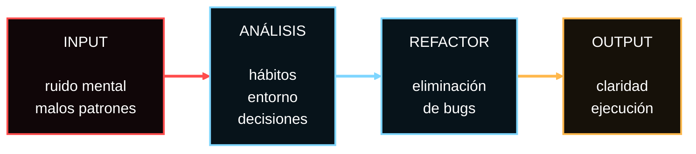
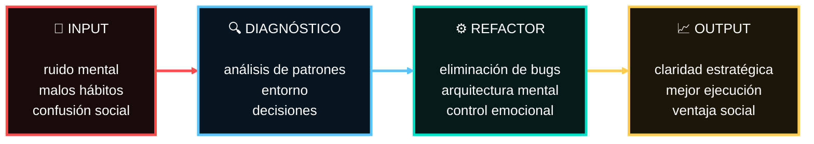
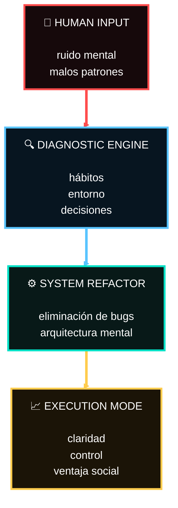

  

  
       >_
    
    

      
      Syntax
      

      

    Asura
      

    

  

🏃TE LO EXPLICO RAPIDITO!

🧠 La empatía es la capacidad de comprender el estado emocional de otra persona, aunque eso no garantice una intención positiva.

- Detectar emociones rápidamente.
- Comprender motivaciones ocultas.
- Generar conexión emocional.
- Riesgo: manipulación emocional.

👉 [[Asura]]
👉 [[Empatía cognitiva]]

> A veces entender a alguien no significa querer ayudarlo.

<iframe width="100%" height="315"
src="https://www.youtube.com/embed/dQw4w9WgXcQ"
title="YouTube video player"
frameborder="0"
allowfullscreen>
</iframe>

📚DOCUMENTACIÓN TÉCNICA

da

