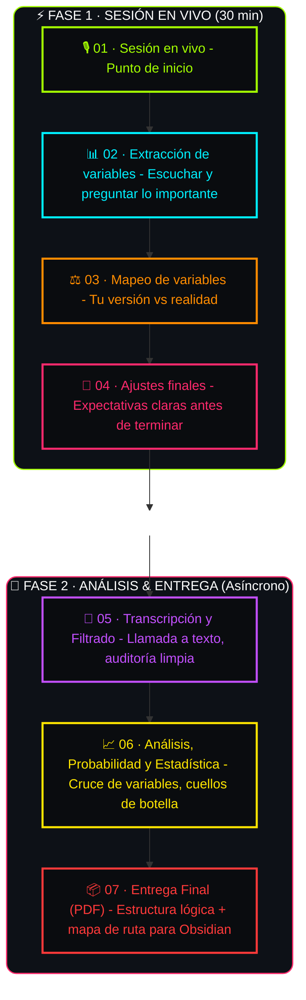

  <!-- CÁSCARA AZUL PIZARRA -->
  
    <!-- Logo + título -->
    

      
        >_
        Alexi.rar
      
      //
      Optimización de Estructura Personal
    

    <!-- Título grande -->
    
Protocol

  
  <!-- PULPA TÉCNICA -->
  
    

      Has reservado una sesión de 30 minutos de alto impacto. Para garantizar que cada segundo de tu inversión se traduzca en una arquitectura de solución clara, operamos bajo este sistema:
    

    <!-- Aquí puedes agregar los pasos del protocolo o más contenido -->
  

  
    

    
📂 Sincronización (Primeros 5 min)

    

      <strong style="color: #ffffff;">Depuración de Entorno:</strong> Validamos que los inputs del cuestionario sean técnicamente precisos. Si detectamos ruido estadístico o variables vagas, realizamos una limpieza inmediata para asegurar que el resto del proceso opere sobre una base sólida.
    

  

  
    

    
⚡ Extracción de Variables (El Núcleo: 20 min)

    

      

        <strong style="color: #ffffff;">Minería de Contexto:</strong> Ejecución de una entrevista dirigida. Mi objetivo es extraer las variables críticas de tu entorno que actualmente operan fuera de tu radar.
      

      

        <strong style="color: #ffffff;">Mapeo de Patrones:</strong> En tiempo real, identifico los puntos de quiebre y recolecto la materia prima necesaria para el análisis. Aquí no se entregan consejos genéricos; se capturan <strong style="color: #ff7b7b;">datos reales</strong>.
      

    

  

  
    

    
📦 Cierre de Captura (Últimos 5 min)

    

      

        <strong style="color: #ffffff;">Finalización del Escaneo:</strong> Concluimos la fase de recolección de información técnica.
      

      

        <strong style="color: #ffffff;">Arquitectura de Salida:</strong> Los datos recolectados se integran a mi sistema de análisis para ser procesados y transformados en una estructura lógica de ejecución que recibirás posteriormente.
      

    

  

  
    

    
⚖️ Políticas de Cancelación y Reprogramación

    

      

        <strong style="color: #ffffff;">Compromiso de Tiempo:</strong> Para garantizar la integridad del flujo de trabajo, cualquier cambio o cancelación debe realizarse con un mínimo de 24 horas hábiles de anticipación.
      

      

        ▸ <strong style="color: #ffffff;">Cancelaciones:</strong> Si cancelas con más de 24 horas de antelación, el reembolso se procesará automáticamente (menos comisiones de la plataforma).
      

      

        ▸ <strong style="color: #ffffff;">Fuera de tiempo:</strong> Si cancelas después de ese periodo o no te presentas a la sesión, el monto de la reserva no será reembolsable. El tiempo de procesamiento de datos ya ha sido asignado y reservado para ti.
      

      

        ▸ <strong style="color: #ffffff;">Reprogramación:</strong> Solo se permite una reprogramación por sesión, siempre que se avise dentro del marco de las 24 horas.
      

    

  

Protocol

